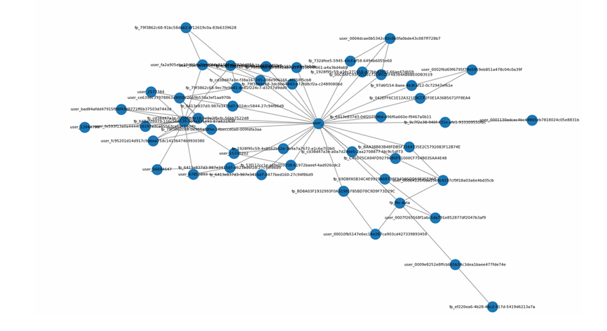
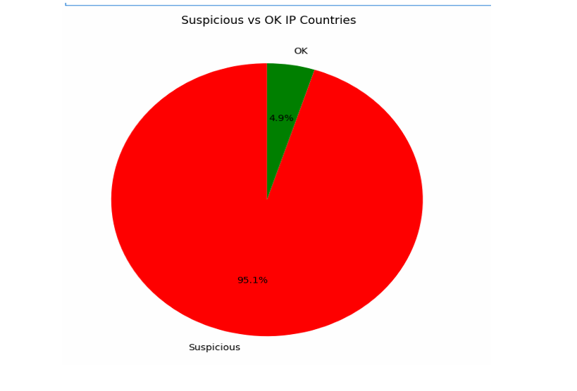
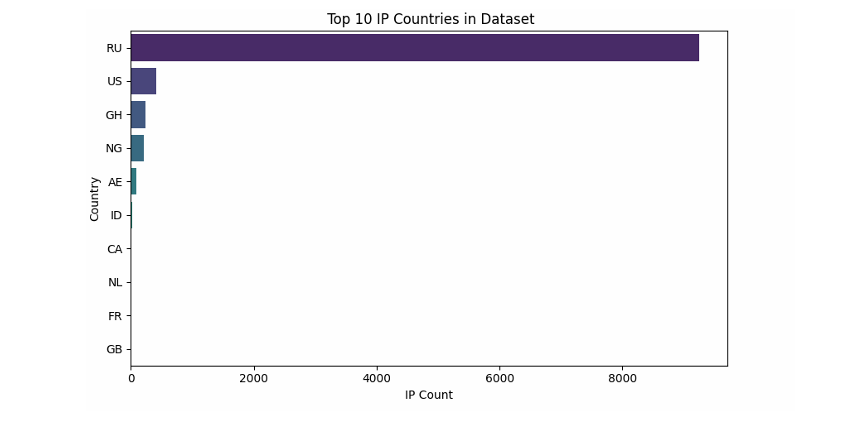
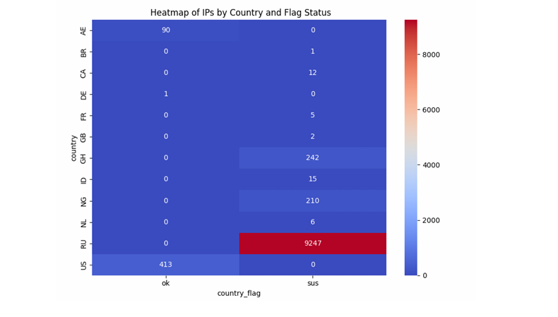
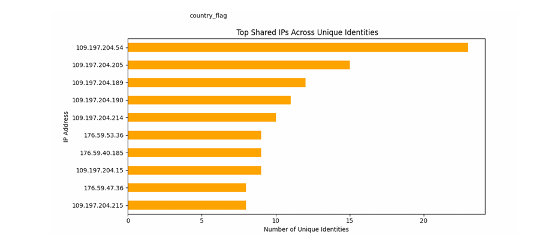

# Cross-Bank Fraud Detection System

## Project Summary

This project presents a modular and extensible fraud detection pipeline designed to analyze user-device-IP metadata across multiple banks. The objective is to uncover fraudulent behavior such as identity reuse, emulator usage, IP-based coordination, and account farming.

The pipeline is structured into multiple analytical **profiles**, each targeting a specific fraud pattern. These include both **rule-based heuristics** and **unsupervised ML models** such as DBSCAN and Isolation Forest. The project also integrates **IP enrichment** from external APIs, visual analysis, and produces ready-to-use artifacts for fraud investigators or fraud intelligence systems.

## Project Detials

* Applies ML models realistically (not just for demo)
* Combines data enrichment with domain-specific rule logic
* Focuses on modularity and interpretability over complexity
* Is designed for real corporate workflows, not academic settings

## Folder Structure

├── Additional files/       # Outputs from each profile (CSV/XLSX)
├── code/                   # Jupyter notebook with the full implementation
├── Documentation/          # PDF/text reports, visuals, executive summary
├── enriched csv/           # IP enrichment outputs (from IPInfo API)

## Key Technologies Used

* **Python 3.8+**
* **Pandas**, **NumPy**
* **Scikit-learn** (DBSCAN, Isolation Forest)
* **Matplotlib**, **Seaborn** for visuals
* **NetworkX** for graph-based user-device linking
* **ipinfo.io API** for IP location enrichment
* **Excel & CSV output formats**

## Analytical Profiles

### Profile 1: Cross-Bank Identity Detection

* Groups users by identity across multiple banks
* Flags identities reused in different institutions
* Detects anonymous identity shared across 11 banks

### Profile 2: Device Clustering & Shared Fingerprints

* Clusters device fingerprints using DBSCAN
* Detects reused devices across different users
* Builds a graph to visualize identity-device overlaps

### Profile 3: Emulator/Bot Behavior Detection

* Flags devices with outdated OS/browser versions
* Identifies missing GPU data and odd screen resolutions
* Uses Isolation Forest to isolate non-human environments

### Profile 4: Fingerprint Reuse across Multiple Identities

* Finds digital fingerprints reused across hundreds of users
* Detects large-scale identity farming using single device

### Profile 5: IP Metadata Analysis & Fraud Ring Detection

* Merges enriched IP geolocation data into main dataset
* Flags:

  * IPs shared across 10+ identities
  * Timezone vs OS inconsistencies
  * VPN/Cloud provider IPs (e.g., AWS, M247)
  * Suspicious countries (e.g., RU, CN, IR)
* Produces 4 visualizations:

  * Suspicious vs OK IP share
  * Top IP countries
  * Heatmap by country/flag
  * Top shared IPs by identity count

---

## Visual Outputs

All charts were generated using `matplotlib` and `seaborn` and are available in:

* `Documentation/`: For executive report visuals
* `code/`: Jupyter Notebook visual output cells

## Outputs & Deliverables

Each profile generates structured data in:

* `.csv` and `.xlsx` formats (`Additional files/`)
* A final merged & flagged dataset for all enriched IPs
* A clean, modular notebook: `Fraud Detection.ipynb`

## Business Relevance

This project mirrors actual anti-fraud analyst workflows:

* Enrichment from external threat intelligence
* Profile-based pattern recognition
* Modular flagging and manual triage support
* Clear exportable evidence for risk or compliance teams

It could be used by:

* Banks investigating multi-account fraud rings
* Fraud detection SaaS providers
* AML/KYC analysts in fintech companies

